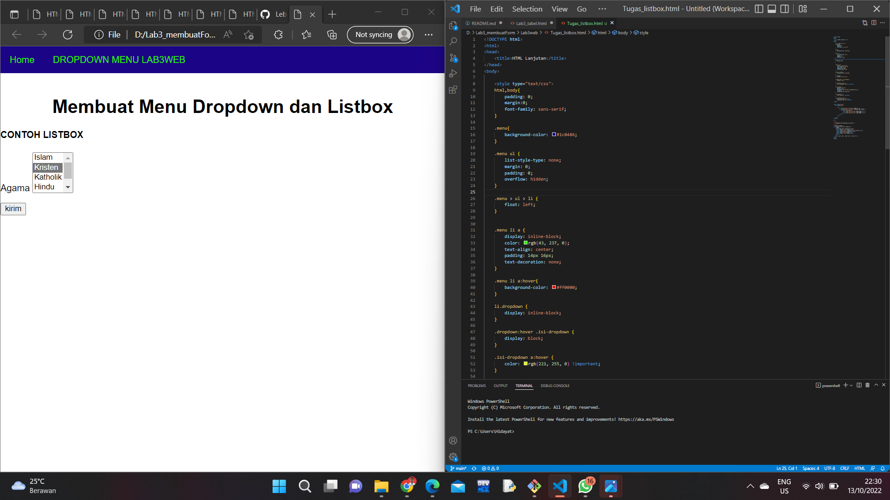

# Lab3web
## Pratikum 3
## Hidayat Tulloh
## 312110110
## TI.21.B.1
## Universitas Pelita Bangsa

# PROSES
1. Membuat dokumen HTML dengan nama file lab3_list.html dan Membuat Ordered list

2. Membuat Unordered List

3. Membuat Description List

4. Membuat file HTML baru dan membuat tabel

5. Mengatur magrin tabel

6. Menggabungkan sel Data

7. Membuat file HTML baru,Membuat form dan membuat tabel

8. Menambahkan css agar lebih menarik

# Pernyataan Dan Tugas
# Membuat form yang menampilkan dropdown menu dan listbox dengan multiple selection.
# Membuat Dropdown Menu

# Membuat Listbox Dengan Multiple Selection

